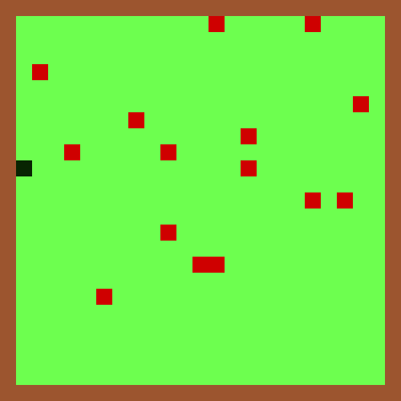
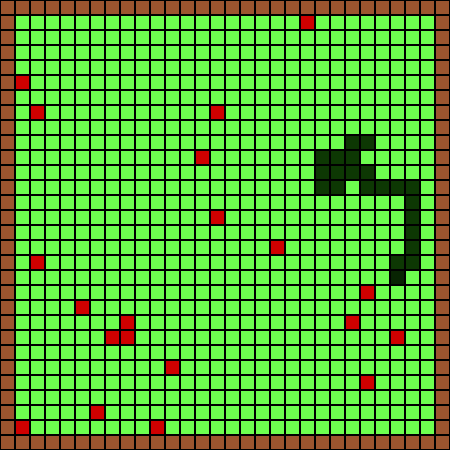
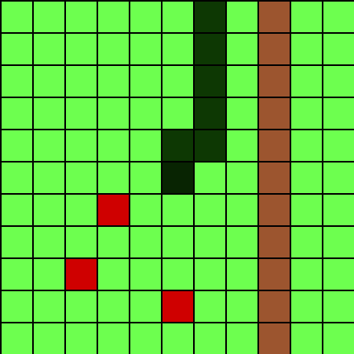
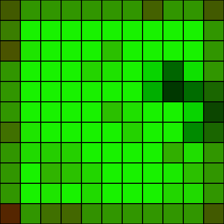
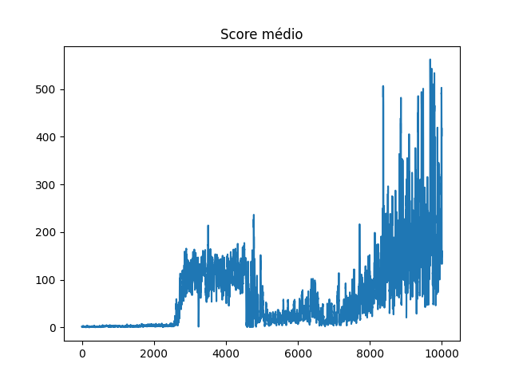
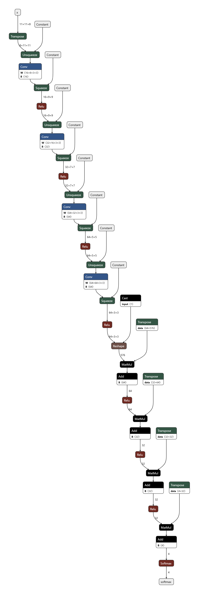

# Jogo da cobrinha com Redes Neurais

# Créditos

- ### Autor: [Rafael Marinho dos Anjos](https://github.com/Rafael-Marinho-dos-Anjos)

# Introdução

Este projeto consiste na implementação do "Jogo da cobrinha" juntamente com a modelagem e treinamento de modelos de redes neurais para controlá-lo de forma automática.

Todo o projeto foi feito de forma que as configurações do jogo, como tamanho do mapa e quantidade de comidas espalhadas, seja configurável e não gere impacto no funcionamento da inteligência artificial resposável por jogar.

Todo o processo de treinamento dos algoritmos foi feito utilizando conceitos de aprendizagem por reforço, onde o agente interage com o sistema e isso gera uma resposta positiva ou negativa, que é utilizada como base para realizar o ajuste de pesos.

# Gerando entrada para o modelo

A entrada do modelo consiste em um tensor de dimensões 11x11x8 (pode ser interpretado como uma imagem de dimensão 11x11 com 8 canais), onde os 8 canais são divididos entre 4 canais de visão panorâmica e 4 canais de visão local.

- Canais de visão panorâmica: São formados pelo redimensionamento (utilizando interpolação por área) das matrizes de localização de elementos do mapa geral. Cada canal contém as localizações de elementos específicos entre: Casas vazias, comidas, corpo da cobra e parede (limite do mapa).  
Esses canais contém informações sobre a distribuição geral dos elementos sobre o mapa todo, fazendo com que a cobra consiga localizar elementos distantes (fora do alcance da visão local).

- Canais de visão local: São formados pelo corte das matrizes de localização de elementos do mapa geral de forma a coincidir a cabeça da cobra com o elemento central. Cada canal contém as localizações de elementos específicos entre: Casas vazias, comidas, corpo da cobra e parede (limite do mapa).  
Esses canais contém informações precisas sobre os elementos mais próximos da cabeça da cobra, fazendo com que a atenção a elementos iminentes seja maior.

### Canais de visão local e panorâmica

| Mapa | Canais Locais | Canais Globais |
|----------|---------------|----------------|
|  |  |  |
| Visão do jogador | Localização exata dos elementos mais próximos da cabeça da serpente | Densidade de localização dos elementos distribuídos pelo mapa |

# Saída do modelo

O modelo retorna um vetor de probabilidades de tamanho 4, onde a posição de maior valor define a direção do próximo movimento.

| Posição do elemento de maior valor | Movimento |
|------------------------------------|-----------|
| 0 | CIMA |
| 1 | BAIXO |
| 2 | ESQUERDA |
| 3 | DIREITA |

# Processo de treino

É executado um jogo até que se atinja game-over por vez, cada movimento pontuado (comer) é recompensado positivamente e movimentos catastróficos (esbarrar no próprio corpo ou nas paredes) é recompensado negativamente.

## Reforço positivo

Ao fazer um movimento pontuado é gerado um tensor de reforço com base no último movimento feito. Esse tensor de reforço é dado por uma sequência de zeros, exceto na localização do elemento de maior valor da última saída do modelo, que será 1.

Esse tensor de reforço orienta o treinamento a repetir o comportamento em situações similares.

- Exemplo:

| Descrição | Valor |
|-----------|-------|
| Saída do modelo | [0.15, 0.10, 0.60, 0.15] |
| Tensor de reforço | [0.00, 0.00, 1.00, 0.00] |

Uma vez criado o tensor de reforço, é calculada a loss com base nele e na última saída do modelo para realizar o processo de ajuste dos pesos.

## Reforço negativo

Ao fazer um movimento catastrófico é gerado um tensor de penalização com base no último movimento feito. Esse tensor de reforço é dado por uma sequência de uns, exceto na localização do elemento de maior valor da última saída do modelo, que será 0.

Esse tensor de penalização orienta o treinamento a considerar as outras direções de navegação em casos similares.

- Exemplo:

| Descrição | Valor |
|-----------|-------|
| Saída do modelo | [0.45, 0.10, 0.30, 0.15] |
| Tensor de penalização | [0.00, 1.00, 1.00, 1.00] |

Uma vez criado o tensor de penalização, é calculada a loss com base nele e na última saída do modelo para realizar o processo de ajuste dos pesos.

### Modificador de penalização

Levando em conta o fato de que em um único jogo é possível que a cobra coma várias vezes (reforço positivo), mas tenha apenas uma única atitude catastrófica (reforço negativo), é interessante ajustar a intensidade dos ajustes das ações indesejadas.

Para isso foi criado um modificador de penalização, que consiste em um número positivo que é multiplicado ao tensor de penalização antes que seja calculada a loss para que se intensifique (caso o modificador seja maior que 1) ou atenue (caso o modificador seja menor que 1) o ajuste.

Durante o treinamento foi utilizado 5 como modificador de penalização constante.

### Penalização por game-over errante

Caso a cobra faça 100 movimentos seguidos sem comer nada, o jogo automaticamente dá game-over, como esse tipo de situação é indesejada (para evitar que a cobra fique presa em loop num mesmo local), esse fim de jogo mesmo não sendo colisão (movimento catastrófico) também é penalizado da mesma forma.

# Treinamentos

Foram realizados diversos passos de treinamento utilizando diferentes modelos.

Cada  treinamento realizado é identificado por uma versão no padrão v**A**.**B**, onde *A* indica o modelo de rede e *B* indica o passo de treinamento executado.

| Versão | Pesos | Mapa | Visualização | Comidas | LR | Jogos | Zerar gradiente após | Auto Game-Over |
|--------|-------|------|--------------|---------|----|-------|----------------------|----------------|
| vX.0 | cnn_X0.[pth / onnx] | 25x25 | 11x11 | 50 | 1e-5 | 10.000 | 5 nem* | 100 nem* |
| vX.1 | cnn_X1.[pth / onnx] | 25x25 | 11x11 | 25 | 5e-6 | 10.000 | 25 nem* | 100 nem* |
| vX.3 | cnn_X2.[pth / onnx] | 50x50 | 11x11 | 25 | 5e-6 | 10.000 | 50 nem* | 100 nem* |

*nem: No Eating Moves (movimentos sem comer).

As primeiras versões (vX.0) de treinamento tem como objetivo fazer com que o algoritmo reconheça e priorize as comidas mais próximas, ignorando movimentos de busca muito longos (mais de 5 movimentos).

Nas versões vX.1, o intuito é fazer com que o algoritmo consiga aprender padrões de busca para comidas mais afastadas reduzindo a quantidade de comidas disponíveis, mas ainda limitando o tamanho da busca (até 25 movimentos).

As versões vX.2 são treinadas com um mapa mais amplo, fazendo com que o algoritmo seja forçado a explorar o mapa atrás de comidas fora dos canais de visão local.

# Selecionando momento de melhor desempenho

Para selecionar o momento de melhor ajuste de pesos, é feita a média dos scores dos últimos 10 jogos, caso essa média supere o atual melhor desempenho (maior média anterior), uma cópia do modelo é salva e o melhor desempenho é atualizado.

## Calculo de scores:

O cálculo dos scores é feito da seguinte forma:

$$ Score = \sum_{1}^n \left\lbrace \begin{array}{lc} 
    \frac{T^2}{n} \text{, se comeu no turno} \\
    0 \text{, se não comeu no turno}
\end{array} \right. $$

Onde:

- T = Tamanho da cobra (1 + quantidade total de comidas);
- n = Turno atual (número total de movimentos);

# Arquiteturas utilizadas

As arquiteturas de redes utilizadas são mostradas a seguir:

## v1.x

## v2.x

