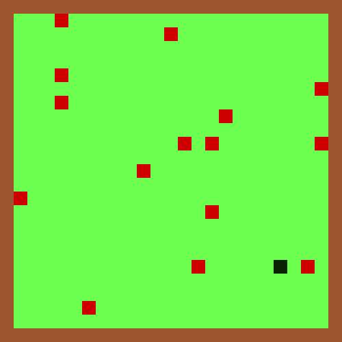

# Jogo da cobrinha com Redes Neurais

# Créditos

- ### Autor: [Rafael Marinho dos Anjos](https://github.com/Rafael-Marinho-dos-Anjos)

# Gerando entrada para o modelo

A entrada do modelo consiste em um tensor de dimensões 11x11x8 (pode ser interpretado como uma imagem 11x11 de 8 canais), onde os 8 canais são divididos entre 4 canais de visão panorâmica e 4 canais de visão local.

- Canais de visão panorâmica: São formados pelo resize (utilizando interpolação por área) das matrizes de localização de elementos do mapa geral. Cada canal contém as localizações de elementos específicos entre: Casas vazias, comidas, corpo da cobra e parede (limite do mapa).  
Esses canais contém informações sobre a distribuição geral dos elementos sobre o mapa todo, fazendo com que a cobra consiga localizar elementos distantes (fora do alcance da visão local).

- Canais de visão local: São formados pelo corte das matrizes de localização de elementos do mapa geral de forma a coincidir a cabeça da cobra com o elemento central. Cada canal contém as localizações de elementos específicos entre: Casas vazias, comidas, corpo da cobra e parede (limite do mapa).  
Esses canais contém informações precisas sobre os elementos mais próximos da cabeça da cobra, fazendo com que a atenção a elementos iminentes seja maior.

# Saída do modelo

O modelo retorna um vetor de probabilidades de tamanho 4, onde a posição de maior valor define a direção do próximo movimento.

| Posição do elemento de maior valor | Movimento |
|------------------------------------|-----------|
| 0 | CIMA |
| 1 | BAIXO |
| 2 | ESQUERDA |
| 3 | DIREITA |

# Processo de treino

É executado um jogo até que se atinja game-over por vez, cada movimento pontuado (comer) é recompensado positivamente e movimentos catastróficos (esbarrar no próprio corpo ou nas paredes) é recompensado negativamente.

## Reforço positivo

Ao fazer um movimento pontuado é gerado um tensor de reforço com base no último movimento feito. Esse tensor de reforço é dado por uma sequência de zeros, exceto na localização do elemento de maior valor da última saída do modelo, que será 1.

Esse tensor de reforço orienta o treinamento a repetir o comportamento em situações similares.

- Exemplo:

| Descrição | Valor |
|-----------|-------|
| Saída do modelo | [0.15, 0.10, 0.60, 0.15] |
| Tensor de reforço | [0.00, 0.00, 1.00, 0.00] |

Uma vez criado o tensor de reforço, é calculada a loss com base nele e na última saída do modelo para realizar o processo de ajuste dos pesos.

## Reforço negativo

Ao fazer um movimento catastrófico é gerado um tensor de penalização com base no último movimento feito. Esse tensor de reforço é dado por uma sequência de uns, exceto na localização do elemento de maior valor da última saída do modelo, que será 0.

Esse tensor de penalização orienta o treinamento a considerar as outras direções de navegação em casos similares.

- Exemplo:

| Descrição | Valor |
|-----------|-------|
| Saída do modelo | [0.45, 0.10, 0.30, 0.15] |
| Tensor de penalização | [0.00, 1.00, 1.00, 1.00] |

Uma vez criado o tensor de penalização, é calculada a loss com base nele e na última saída do modelo para realizar o processo de ajuste dos pesos.

# Treinamentos

| Versão | Pesos | Mapa | Visualização | Comidas | LR | Jogos | Zerar gradiente após | Auto Game-Over |
|--------|-------|------|--------------|---------|----|-------|----------------------|----------------|
| v1.0 | cnn_10.pth | 25x25 | 11x11 | 50 | 1e-5 | 20.000 | 5 nem* | 100 nem* |
| v1.1 | cnn_11.pth | 25x25 | 11x11 | 25 | 5e-6 | 10.000 | 25 nem* | 100 nem* |
| v1.3 | cnn_12.pth | 50x50 | 11x11 | 75 | 5e-6 | 10.000 | 25 nem* | 100 nem* |

*nem: No Eating Moves (movimentos sem comer).

As primeiras versões (v*.0) de treinamento tem como objetivo fazer com que o algoritmo reconheça e priorize as comidas mais próximas, ignorando movimentos de busca muito longos (mais de 5 movimentos).

Nas versões v*.1, o intuito é fazer com que o algoritmo consiga aprender padrões de busca para comidas mais afastadas reduzindo a quantidade de comidas disponíveis, mas ainda limitando o tamanho da busca (até 25 movimentos).

As versões v*.2 são treinadas com um mapa mais amplo, fazendo com que o algoritmo seja forçado a explorar o mapa.

# Selecionando momento de melhor desempenho

Para selecionar o momento de melhor ajuste de pesos, é feita a média dos scores dos últimos 10 jogos, caso essa média supere o atual melhor desempenho (maior média anterior), uma cópia do modelo é salva e o melhor desempenho é atualizado.

## Calculo de scores:

O cálculo dos scores é feito da seguinte forma:

$$ Score = \sum_{1}^n \left\lbrace \begin{array}{lc} 
    \frac{T^2}{n} \text{, se comeu no turno} \\
    0 \text{, se não comeu no turno}
\end{array} \right. $$

Onde:

- T = Tamanho da cobra (1 + quantidade total de comidas);
- n = Turno atual (número total de movimentos);

# Arquiteturas utilizadas

As arquiteturas de redes utilizadas são mostradas a seguir:

## v1.*

## v2.*
